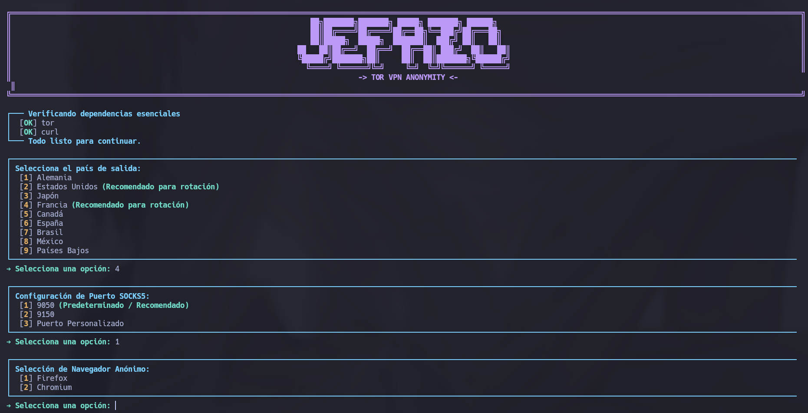
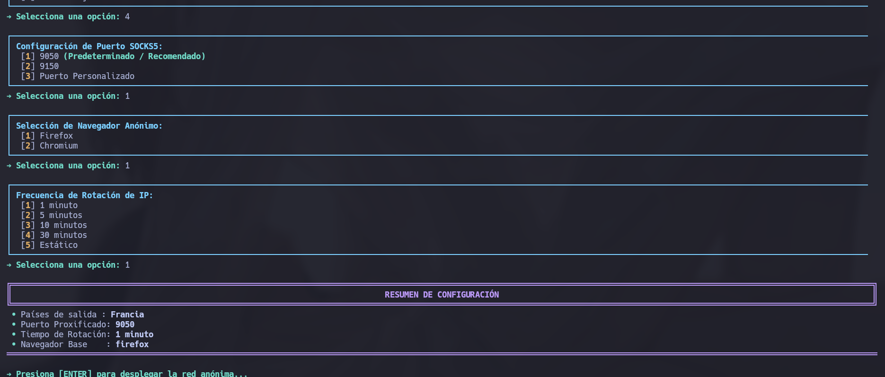
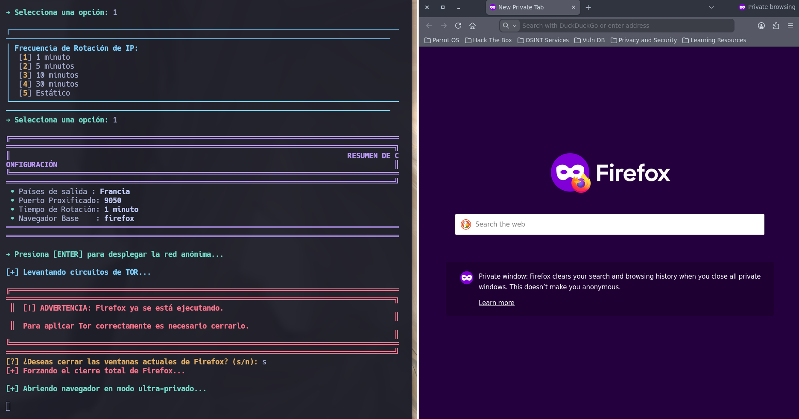
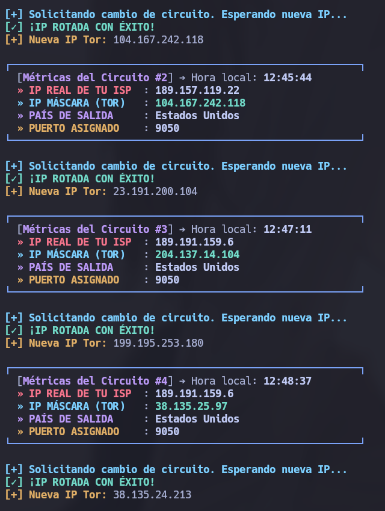

---

# TOR VPN ANONYMITY

Herramienta avanzada en Python para automatizar conexiones anónimas mediante TOR, rotación automática de IPs y lanzamiento de navegadores privados usando SOCKS5.

---

# Características

* Rotación automática de IP TOR
* Selección de país de salida
* Compatibilidad con Firefox y Chromium
* Configuración automática de TOR
* Detección de IP real y IP TOR
* Interfaz visual en terminal
* Soporte para múltiples puertos SOCKS5
* Modo privado/incógnito automático
* Reinicio automático de circuitos TOR
* Limpieza automática de perfiles temporales
* Supresión de errores D-Bus/GTK
* Desescalado seguro de privilegios
* Compatible con Linux/Kali/Debian/Ubuntu

---

# Requisitos

Antes de ejecutar la herramienta asegúrate de tener instalados:

* Python 3
* TOR
* curl
* Firefox ESR o Chromium

## Instalación rápida de dependencias

### Debian / Ubuntu / Kali / Parrot

```bash
sudo apt update

sudo apt install -y \
tor \
curl \
python3 \
python3-pip \
firefox-esr \
chromium
```

---

# Instalación

## Clonar el repositorio

```bash
git clone https://github.com/Alejandro609x/tor-vpn-anonymity.git
```

## Entrar al directorio

```bash
cd tor-vpn-anonymity
```

## Dar permisos de ejecución

```bash
chmod +x tor_anonymity.py
```

Aunque el script normalmente se ejecuta con `sudo`, otorgar permisos puede facilitar la ejecución directa.

---

# Uso

## Ejecutar como ROOT

```bash
sudo python3 tor_anonymity.py
```

o:

```bash
sudo ./tor_anonymity.py
```

---

# Flujo de Funcionamiento

El script sigue automáticamente el siguiente proceso:

```text
[Inicio]
   │
   ▼
[Verificación de privilegios ROOT]
   │
   ▼
[Comprobación de dependencias]
(TOR / Curl / Navegador)
   │
   ▼
[Selección interactiva]
- País
- Puerto SOCKS5
- Navegador
- Intervalo de rotación
   │
   ▼
[Modificación dinámica de /etc/tor/torrc]
   │
   ▼
[Reinicio seguro del servicio TOR]
   │
   ▼
[Limpieza de perfiles y candados]
(.parentlock)
   │
   ▼
[Lanzamiento aislado del navegador]
(usuario no-root)
   │
   ▼
[Monitoreo y rotación automática]
de circuitos TOR
```

---

# Funciones Principales

## Selección de País de Salida

La herramienta permite forzar nodos de salida TOR mediante modificación dinámica de:

```bash
/etc/tor/torrc
```

Ejemplo:

```bash
ExitNodes {DE}
StrictNodes 1
```

---

# Países Disponibles

| País           | Código |
| -------------- | ------ |
| Alemania       | DE     |
| Estados Unidos | US     |
| Japón          | JP     |
| Francia        | FR     |
| Canadá         | CA     |
| España         | ES     |
| Brasil         | BR     |
| México         | MX     |
| Países Bajos   | NL     |

---

# Puertos SOCKS5 Compatibles

* 9050
* 9150
* Personalizado

> El uso de puertos personalizados depende de la configuración local de TOR.

---

# Rotación Automática de IP

La herramienta puede rotar automáticamente:

* Cada 1 minuto
* Cada 5 minutos
* Cada 10 minutos
* Cada 30 minutos
* Modo estático

La rotación se realiza sin reiniciar completamente TOR utilizando:

```text
SIGNAL NEWNYM
```

sobre el puerto de control `9051`.

---

# Arquitectura Técnica

# 1. Desescalado Seguro de Privilegios

Ejecutar navegadores como ROOT es una mala práctica de seguridad.

El script detecta automáticamente el usuario real:

```python
usuario_real = os.getenv("SUDO_USER")
```

y lanza el navegador aislado:

```python
subprocess.Popen([
    "sudo", "-u", usuario_real, nav
])
```

Esto evita:

* Corrupción de perfiles
* Riesgos de seguridad
* Bloqueos de Firefox/Chromium

---

# 2. Limpieza de Candados `.parentlock`

Firefox deja archivos de bloqueo cuando se cierra abruptamente.

El script elimina automáticamente:

```python
lock_file = os.path.join(perfil_temp, ".parentlock")

if os.path.exists(lock_file):
    os.remove(lock_file)
```

Esto previene:

```text
Firefox is already running
```

---

# 3. Rotación de Circuitos TOR

En lugar de reiniciar el demonio completo:

```bash
systemctl restart tor
```

la herramienta usa sockets TCP para interactuar directamente con TOR:

```python
SIGNAL NEWNYM
```

Ventajas:

* Menor tiempo de espera
* Reconstrucción instantánea de circuitos
* Menor pérdida de conexión
* Mayor estabilidad

---

# 4. Supresión de Logs D-Bus y GTK

Firefox y Chromium generan múltiples mensajes innecesarios en terminal:

```text
Gtk-WARNING
dbus-daemon
```

La herramienta redirige automáticamente estos errores:

```python
stderr=subprocess.DEVNULL
stdout=subprocess.DEVNULL
```

manteniendo la terminal limpia.

---

# 5. Verificación de IP Pública

La herramienta compara:

* IP real
* IP TOR

Utilizando:

```bash
curl ifconfig.me
```

o servicios equivalentes.

---

# Compatibilidad

Probado en:

* Kali Linux
* Debian
* Ubuntu
* Parrot OS

---

# Seguridad

La herramienta:

* No almacena logs
* No guarda historial
* Usa perfiles temporales
* Elimina residuos de sesión
* Aísla navegadores automáticamente

---

# Capturas

## Menú Principal

```text
[1] Seleccionar País
[2] Seleccionar Puerto SOCKS5
[3] Navegador
[4] Rotación de IP
[5] Iniciar TOR
```

## Monitoreo de IP

```text
IP REAL : XXX.XXX.XXX.XXX
IP TOR  : XXX.XXX.XXX.XXX
ESTADO  : ANÓNIMO
```

---

# Ejemplo de Configuración TOR

```bash
SOCKSPort 9050
ControlPort 9051
CookieAuthentication 1
```

---

# Posibles Errores

## TOR no iniciado

```text
ERROR: TOR service not running
```

Solución:

```bash
sudo systemctl start tor
```

---

## Puerto ocupado

```text
Address already in use
```

Verificar:

```bash
sudo lsof -i :9050
```

---

## Firefox bloqueado

```text
Firefox is already running
```

La herramienta elimina automáticamente `.parentlock`, pero también puedes ejecutar:

```bash
pkill firefox
```

---

# Recomendaciones

* Utilizar Firefox ESR
* No maximizar ventanas
* Evitar instalar extensiones
* No iniciar sesión en cuentas personales
* Usar resoluciones aleatorias
* Rotar nodos periódicamente

---

# Advertencia Legal

Esta herramienta fue desarrollada únicamente con fines:

* Educativos
* Investigación
* Privacidad
* Pruebas de anonimato

El usuario es completamente responsable del uso que le dé al software.

---

# Repositorio

[tor-vpn-anonymity GitHub Repository](https://github.com/Alejandro609x/tor-vpn-anonymity?utm_source=chatgpt.com)

